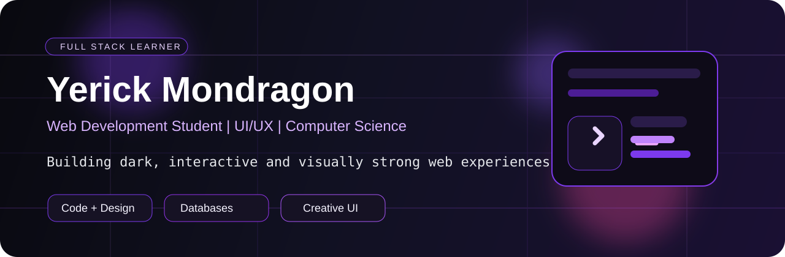

  

<h1 align="center">Yerick Mondragon</h1>

  <strong>Web Development Student | Full Stack Learner | UI/UX &amp; Computer Science Enthusiast</strong>

  I build web experiences that combine code, design, databases and creative ideas.

  
  
  
  

  

---

## About Me

- I'm a Web Development student from Costa Rica.
- I'm interested in frontend, backend, databases, UI/UX design and computer science.
- I'm currently building **Speleum**, a cave survival web game.
- I enjoy creating projects with strong visual identity, dark interfaces and interactive experiences.
- I like videogames, design, animation, pixel art and movies and series.
- I'm learning more about system design, databases, deployment, security basics and full-stack development.
- My goal is to become a strong full stack developer with good design taste and solid technical foundations.

---

## Current Focus

- Building **Speleum** and improving its gameplay systems and web architecture.
- Strengthening my full-stack development skills across frontend and backend.
- Learning more about databases, backend architecture and production-ready systems.
- Practicing UI/UX, responsive design and strong visual identity.
- Studying computer science fundamentals and problem-solving.
- Improving deployment, scalability and real-world project workflows.

---

## Featured Projects

### Speleum

  A cave survival web game with limited vision, underground creatures, radar signals, combat, ranking, authentication and multiplayer features.

  <strong>Tech:</strong>

  
  
  

  
  

### GENIO Web Builder

  A web builder platform concept for small businesses, focused on drag-and-drop website creation, UI/UX, frontend structure and visual identity.

  <strong>Tech:</strong>

  

  
  

---

## Tech Stack

### Frontend

  

### Backend

  

  
  
  
  

### Databases

  

### Computer Science / Core Interests

  
  
  
  
  
  
  
  

### Tools

  

  
  

### Design / Creative

  
  
  
  
  
  

### Learning / Exploring

  
  
  
  
  
  
  
  

---

## GitHub Stats

  
  

  

  

---

## Style & Interests

  
  
  
  
  
  

---

## Let's Connect

  
  
  
  

---

  <i>Learning, building, improving and shaping creative web experiences one project at a time.</i>

